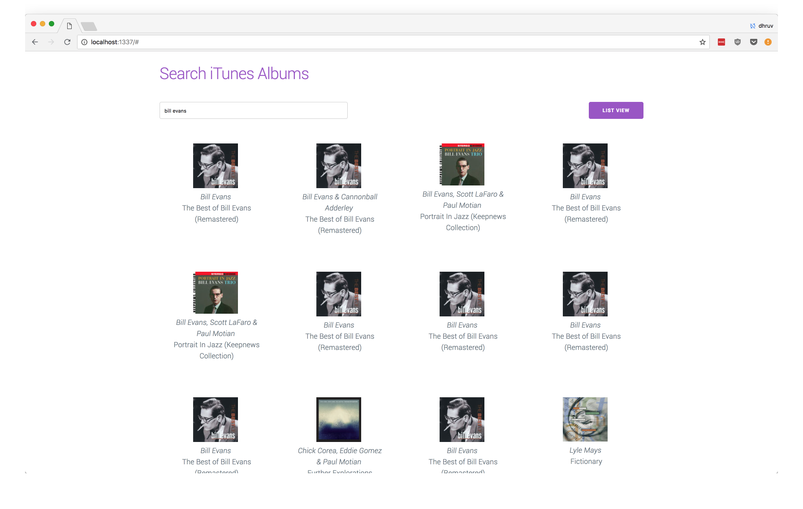
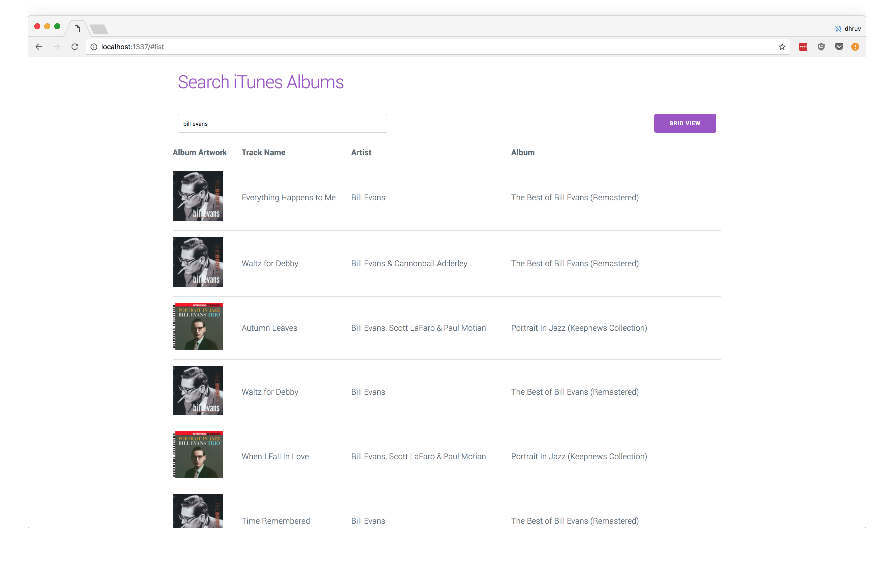

# Search iTunes Albums

A small web-app to explore albums using the iTunes API. Made using Backbone and Marionette.

## Getting started

* Install
  * Clone the repository: `git clone https://github.com/dhruuuuuv/search-itunes-albums`
  * Inside this folder run: `npm install`

* Running
  * run `npm run dev` - to start the webpack-dev-server
  * visit localhost:1337/# to use the app

## Usage

  * Search for results by typing in the search bar (no need to click enter).
  * The app has live updating. You may need to wait a second for the data from the server to come through.
  * Press the button to switch between Grid Mode (default) and List Mode.
  * Returns 20 albums per page, with pageable results. Use the buttons to navigate the results.

## Notes

  * The search matches any query field (track, artist title).
  * The grid view doesn't show track name (the list view does), so there may be multiple entries of each album, corresponding to
  different tracks on an album.

## Screenshots

